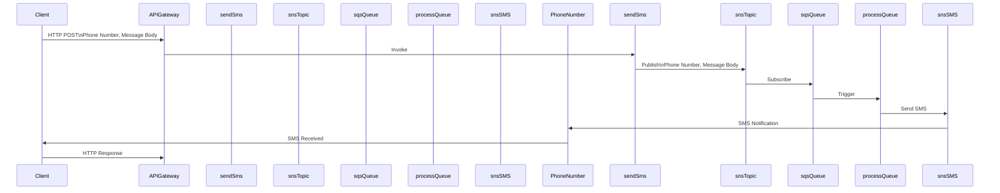

# AWS SMS Service

This project is an asynchronous service deployed to AWS using the Serverless Framework. The service receives an HTTP POST request containing a phone number and message body, then sends an SMS text message using AWS SNS, SQS, and Lambda.

## Project Structure

```
project-root
│
├── src
│ ├── controllers
│ │ └── smsController.ts
│ ├── services
│ │ └── snsService.ts
│ ├── functions
│ │ └── sendSms.ts
│ └── app.ts
│
├── serverless.yml
├── tsconfig.json
├── webpack.config.js
├── package.json
└── jest.config.js
```

## Installation

```bash
yarn
```

## Configuration

Modify serverless.yml to specify your AWS region and customize any other necessary settings.

## Usage

### Deploy to AWS

```bash
serverless deploy
```

### Send SMS via HTTP POST
```bash
curl -X POST <API_GATEWAY_ENDPOINT> -H "Content-Type: application/json" -d '{"phoneNumber": "+1234567890", "message": "Hello, World!"}'

```

Replace `<API_GATEWAY_ENDPOINT>` with the actual endpoint obtained after deployment.

## Architecture



## Testing

```bash
yarn test
```

# License
This project is licensed under the MIT License - see the LICENSE file for details.